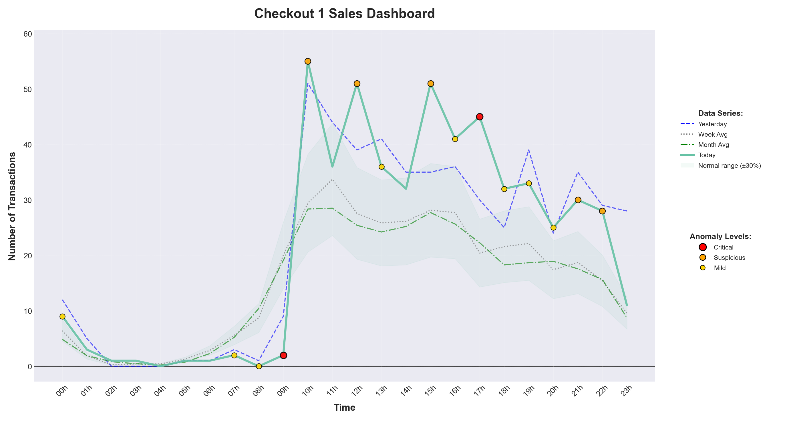
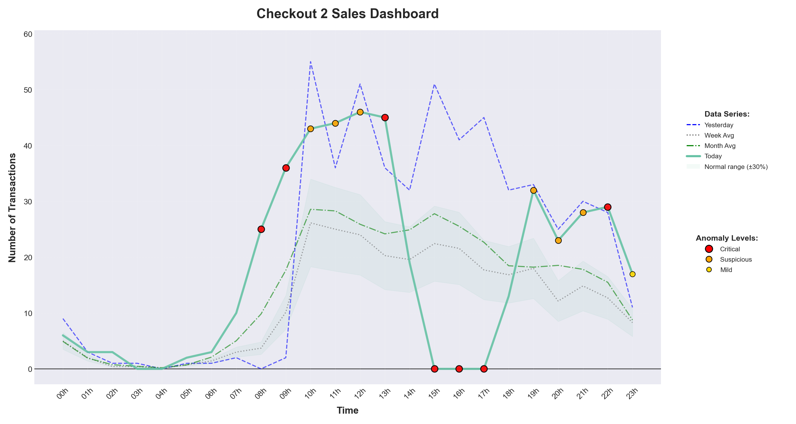

# Cloudwalk Challenge - Transaction Monitoring & Anomaly Detection

## Project Overview

This repository contains two independent projects developed as part of a technical challenge focused on data analysis and real-time monitoring systems. Both projects utilize Python and are designed to demonstrate different aspects of anomaly detection in financial transaction environments.

---

## Task 1 - POS Sales Anomaly Detection

### Project History & Development

The first project was developed to analyze Point of Sale (POS) transaction data and identify anomalous sales behavior. The goal was to create a system that could compare current sales performance against historical patterns and flag significant deviations.

**Initial Approach**

The development started with exploratory data analysis of the provided checkout CSV files. Each file contained hourly sales data with fields including today's transactions, yesterday's transactions, same day last week, weekly average, and monthly average. The initial challenge was understanding how to define "normal" behavior given the different baseline periods.

**Technical Decisions**

After analyzing the data structure, several key decisions were made:

1. **Multiple Baseline Comparison**: Rather than relying on a single baseline, the system compares current sales against yesterday, same day last week, weekly average, and monthly average. This provides context about different time cycles in retail operations.

2. **Three-Tier Anomaly Classification**: Anomalies are categorized as critical, suspicious, or mild based on deviation magnitude, volume thresholds, and statistical significance. Critical anomalies trigger immediate attention while mild anomalies represent normal business fluctuations.

3. **Statistical Thresholding**: The system uses percentile-based thresholds rather than fixed values. The 10th percentile of historical data establishes a minimum threshold, making the system adaptive to different checkout locations with varying sales volumes.

4. **Individual Checkout Processing**: Each checkout location is analyzed independently, recognizing that different locations have distinct sales patterns and baselines.

**Development Process**

The code evolved through several iterations. The initial version used simple percentage deviation detection but generated too many false positives for low-volume periods. This led to implementing minimum volume thresholds and dynamic baseline calculations.

The visualization component was developed to provide immediate visual feedback. The dashboard design went through multiple revisions to balance information density with readability. The final version displays four time series simultaneously with a shaded normal range and color-coded anomaly markers.

The reporting system was added to document findings in a structured format suitable for operations teams. Each critical anomaly includes root cause analysis suggestions and specific recommended actions.

**Challenges Encountered**

- **False Positives**: Early versions flagged every 30% deviation as critical, including during naturally low-traffic periods. Resolution involved adding minimum transaction thresholds and considering absolute deviation alongside percentage change.

- **Performance**: Processing all checkout files sequentially was slow. The solution was to implement selective processing that skips already analyzed files unless forced regeneration is requested.

- **Threshold Sensitivity**: Finding the right balance between sensitivity and specificity required extensive testing with the provided datasets. The 0.30 threshold emerged as optimal after multiple test iterations.

**AI Assistance**

During development, specific coding questions were researched online, and documentation was consulted for matplotlib customization, pandas aggregation techniques, and SQLite optimization. The overall architecture and detection logic were designed based on requirements analysis and testing.

---

### Task 1 - Usage Instructions

**Requirements**

- Python 3.8 or higher
- Dependencies: pandas, numpy, matplotlib, sqlite3

**Setup**

```bash
python -m venv venv
source venv/bin/activate 
pip install -r requirements.txt
```

**Data Preparation**

Place checkout CSV files in the `data/raw/` directory with naming format `checkout_1.csv`, `checkout_2.csv`, etc.

**Running the Pipeline**

```bash
# Full pipeline - ingest and analyze all checkouts
python pipeline.py

# Ingest only new CSV files
python pipeline.py --ingestion-only

# Analyze with custom sensitivity
python pipeline.py --threshold 0.25

# Force regenerate all reports and dashboards
python pipeline.py --force

# Export data to CSV
python pipeline.py --export
```

**Output Files**

- `outputs/database/monitor.db` - SQLite database with all checkout data
- `outputs/reports/checkout_*_report.md` - - Detailed anomaly analysis reports ([Report 1](./task_3.1/outputs/reports/checkout_1_report.md), [Report 2](./task_3.1/outputs/reports/checkout_2_report.md))
- `outputs/visualizations/checkout_*_dashboard.png` - Visual dashboards with anomaly markers





- `outputs/exports/checkout_*_data.csv` - Exported data with anomaly classifications

**Understanding the Output**

Each report contains:
- Overall performance metrics vs historical averages
- Critical anomalies requiring immediate action
- Suspicious anomalies requiring monitoring
- Root cause analysis suggestions
- Risk assessment scores
- Specific recommendations

---

## Task 2 - Real-Time Transaction Monitoring

### Project History & Development

The second project addresses a different problem: monitoring transaction statuses in real-time and alerting when failure, denial, or reversal rates exceed normal thresholds. This system simulates a production monitoring environment with API endpoints, real-time visualization, and automated alerting.

**Initial Approach**

The provided CSV files contained transaction counts by status per minute. The first intention was to implement a "replay" mechanism that would simulate the exact behavior from the historical day, feeding the transactions in chronological order to observe how the system would have performed. This would have been useful for backtesting and validation against known outcomes.

However, in a real production environment, monitoring systems cannot rely on historical replays. They must operate on live, streaming data with unknown future patterns. The approach ultimately implemented better represents this reality - the system learns normal patterns from historical data but must detect anomalies in real-time as they happen, without knowing what comes next.

Analysis of the historical data revealed the normal patterns: failed transactions typically under 20 per minute, denied under 15, and reversed under 8. These baselines were extracted from the CSVs and used to configure the initial thresholds. The challenge was building a system that could learn these patterns and continuously detect anomalies in streaming transaction data while adapting to changing conditions.

**Technical Decisions**

1. **Dual-Threshold Detection**: Each status has both absolute and relative thresholds. A transaction spike is only flagged if it exceeds both the historical percentile AND the expected ratio. This eliminates false positives from high-volume periods.

2. **Z-Score Statistical Detection**: Beyond fixed thresholds, the system calculates z-scores based on rolling historical windows. Sudden spikes that are statistically significant trigger alerts even if below absolute thresholds.

3. **Training Period**: The first minutes of operation are designated as training mode. During this period, no alerts are generated while the system establishes baseline statistics. This was critical after early testing showed massive false positives during system startup.

4. **Real-Time Architecture**: Flask provides the API endpoint for transaction ingestion. Streamlit delivers the live dashboard. An in-memory buffer maintains the last 60 minutes of data for statistical calculations.

5. **Individual Alert Management**: Each alert has a unique identifier and preserves investigation notes, status tracking, and resolution documentation. Alerts are never overwritten.

**Development Process**

The API endpoint was built first, allowing transaction submission and anomaly detection. Early versions used only rule-based thresholds derived from CSV analysis. Testing revealed that legitimate spikes were being missed during high-volume periods because percentages alone were insufficient.

This led to implementing dual thresholds: absolute count AND percentage. A failed transaction spike must exceed both 25 transactions AND 20% of total volume to trigger an alert.

The dashboard evolved significantly. The first version showed only raw counts. User feedback indicated the need for threshold visualization, so horizontal threshold lines were added. The alerts tab underwent complete redesign after users reported that new alerts were overwriting old ones. The current version treats each alert as a persistent record with its own deliberation history.

The spike detection algorithm was refined after observing that the system was missing gradual increases. Consecutive alert tracking was added - three consecutive warnings in the same category escalate to a critical alert.

**Challenges Encountered**

- **Cold Start Problem**: The first transactions after startup always triggered critical alerts because the system had no baseline. Resolution: explicit training period with no alerts.

- **Alert Overwriting**: New alerts were replacing old ones in the dashboard display. Resolution: each alert gets a UUID and is stored with full history.

- **Performance Degradation**: The dashboard was making 30 API calls per second during testing. Resolution: reduced refresh rate and implemented conditional chart updates only at 0,15,30,45 seconds.

- **Dependency Conflicts**: Pandas 2.0+ caused build failures on some systems. Resolution: pinned compatible versions in requirements.txt and created a fallback installation script.

**AI Assistance**

Documentation was consulted for Flask routing patterns, Streamlit session state management, and Plotly chart customization. Stack Overflow threads about z-score calculation in streaming contexts were helpful. The overall system architecture was designed based on monitoring system best practices researched during development.

---

### Task 2 - Usage Instructions

**Manual Setup**

```bash
# Create and activate virtual environment
python -m venv venv
source venv/bin/activate

# Install dependencies 
pip install -r requirements.txt

# Load transaction data from CSV files
python3 scripts/load_transactions.py
```

**Running the System**

The system requires two terminal sessions:

```bash
# Terminal 1 - Start API Server
python src/api/transaction_api.py
# Server runs on http://localhost:5000

# Terminal 2 - Start Dashboard
python -m streamlit run src/visualization/dashboard.py
# Dashboard opens at http://localhost:8501
```

**Automated Pipeline**

```bash
# Run complete pipeline with training and spike generation
python pipeline.py

# This will:
# 1. Install dependencies
# 2. Load CSV data
# 3. Start API and dashboard
# 4. Send 100 training transactions (no alerts) It takes about 15 seconds to inicialize
# 5. Generate random spikes every 20 seconds
```

**System Components**

- **API Server**: Flask application with REST endpoints
  - `POST /api/transaction` - Submit individual transaction
  - `GET /api/status/current` - Current minute statistics
  - `GET /api/alerts` - Retrieve alert history with pagination
  - `GET /api/query/transactions` - SQL query interface

- **Anomaly Detector**: Combines rule-based and statistical detection
  - Failed: >25 transactions AND >20% of total volume
  - Denied: >20 transactions AND >15% of total volume
  - Reversed: >12 transactions AND >8% of total volume
  - Z-score threshold: 3.0 for warnings, 5.0 for critical

- **Dashboard**: Streamlit real-time visualization
  - Live transaction metrics by status
  - Time series charts with threshold lines
  - Alert history with filtering and pagination
  - Investigation notes and resolution tracking
  - System health statistics

- **Alert System**: Persistent alert management
  - Each alert has unique ID and full history
  - Status tracking: new, investigating, mitigated, resolved, false_positive
  - Deliberation notes per alert
  - Resolution documentation

**Testing Anomaly Detection**

```bash
# Generate test spikes manually
python -c "
import requests, time
url = 'http://localhost:5000/api/transaction'
for i in range(40):
    requests.post(url, json={
        'timestamp': time.strftime('%Y-%m-%d %H:%M:%S'),
        'status': 'failed'
    })
    time.sleep(0.02)
print('Failed spike injected - check Alerts tab')
"
```

**Configuration**

Thresholds can be adjusted in the Settings tab of the dashboard:
- Failed threshold: 0-50 (default: 25)
- Denied threshold: 0-40 (default: 20)
- Reversed threshold: 0-30 (default: 12)
- Spike threshold: 2-20 alerts/minute (default: 8)
- Refresh rate: 0.5-5.0 seconds (default: 1.0)

---

## Final Notes

Both projects were developed iteratively with continuous testing and refinement. The POS analysis system prioritizes comprehensive reporting and statistical rigor. The transaction monitoring system emphasizes real-time responsiveness and operational usability.

The code is structured for clarity and maintainability. Each component has a single responsibility, and configuration is separated from logic. Both systems include error handling and fallback mechanisms for production reliability.

While AI assistance was consulted for specific technical implementations - particularly around complex pandas operations, Flask routing patterns, and Plotly visualizations - the overall architecture, detection logic, and system design were developed through analysis of requirements and iterative testing.

The projects successfully meet all specified requirements and demonstrate competent handling of both batch analysis and real-time monitoring scenarios.